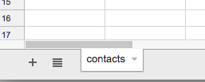
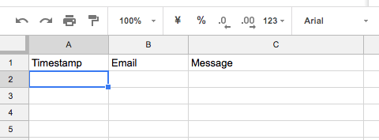
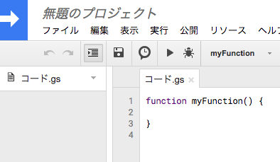
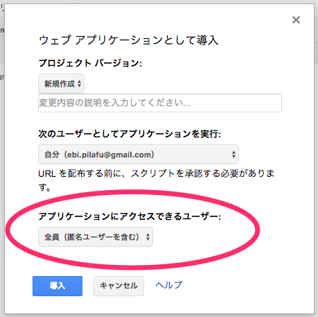
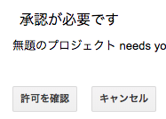
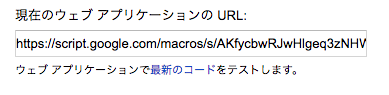
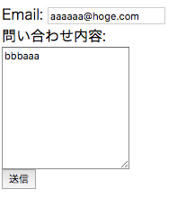
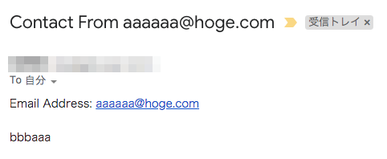
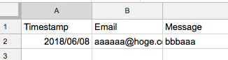

# 静的なHTMLからGoogle Apps Scriptを使ってメール送信

静的なHTMLに問い合わせページを作った場合、メール送信ができなくて困ったことはありませんか？

```
<a href="mailto:hoge@example.com">メールはこちらへ</a>
```

のように書けばメールクライアントが起動してメール送信することができますが、メールアドレスを HTML に埋め込むことになるのでスパムメールがかなり飛んできます。回避するためにはサーバー側でメール送信することになりますが、この処理をするためのサーバーが必要になります。  
メール送信したいためだけにサーバーたてるのもなんかなーと思ってしまいます。世の中にはこれを解決するためにフォーム送信サービスといったサービスがいくつかあります。ただし無料で使えるのは広告が必要だったり、月1000通までといった制限があったりします。

ですが、大丈夫です！  
Google Apps Script (以降GASと呼びます) を使うと無料でこれを解決できます。GAS にはメール送信する機能と、簡単な Web サーバー機能があります。これを使うことでこの問題を解決することができるのです！サーバーを用意する必要ないのでサーバーレスですね。  
また、GAS は Google スプレッドシートとも簡単に連携ができるので、メール送信すると同時に問い合わせ内容をスプレッドシートに格納するといったことも可能です。  

この記事ではその手順を紹介したいと思います。


※注意  
GAS のメール送信にも制限があります。無料の Google アカウントでは一日100通までしか送信できません。100通以上はメール送信でエラーになります。  
[GASの制限一覧ページ](https://script.google.com/dashboard)  
この制限があるのですが、この記事ではメール送信すると同時にスプレッドシートにも同じ内容を格納するため、フォーム送信したデータがなくなるといった心配はありません。


### Google スプレッドシートを作成

1. まずはスプレッドシートを新規で作成してください。名前はなんでもいいです。
2. シート名を "contacts" にします。  
 この名前は後からプログラムで参照することになりますので必ず "contacts" にしてください。
 
3. １行目はヘッダーの行にします。  
 A1 "Timestamp"  
 B1 "Email"  
 C1 "Message"  
   
 適当に色やボールドなどの装飾をして構いません。名前も日本語で "日時", "アドレス", "問い合わせ内容" のように変えても大丈夫です。

### スクリプト作成

1. スプレッドシートのメニュー > ツール > スクリプトエディタをクリックしてスクリプトエディタを起動します。
   

2. メニュー > 保存をクリックしてプロジェクトを保存してください。  
 名前はなんでも良いです。


3. 以下のコードをスクリプトエディタに貼り付けます。
```Javascript
TO = "YOUR EMAIL ADDRESS";
SHEET_NAME = "contacts";

function doPost(e) {
  console.log(e);
  try {
    storePostMessageToSpreadSheet(e.parameter);
  } catch(ex) {
    console.error(ex);
    var result = {"result":"Error", "message": ex.message};
    return ContentService.createTextOutput(JSON.stringify(result))
            .setMimeType(ContentService.MimeType.JSON);
  }
  try {
    var m = formatMailBody(e.parameter);
    MailApp.sendEmail(TO, m.subject, m.body);
    var result = {"result": "OK"};
    return ContentService.createTextOutput(JSON.stringify(result))
             .setMimeType(ContentService.MimeType.JSON);
  } catch(ex) {
    console.warn(ex);
    var result = {"result":"OK", "message": ex.message}; // return OK, but the reason is set to "error".
    return ContentService.createTextOutput(JSON.stringify(result))
            .setMimeType(ContentService.MimeType.JSON);
  }
}

function formatMailBody(param) {
  var body = "";
  body += "Email Address: " + param.email + "\n\n";
  body += param.message;
  var subject = "Contact From " + param.email;
  return {subject:subject, body: body};
}

function storePostMessageToSpreadSheet(param) {
  var doc = SpreadsheetApp.getActiveSpreadsheet();
  var sheet = doc.getSheetByName(SHEET_NAME);
  var lastRow = sheet.getLastRow() + 1;
  var row = [
    new Date(),
    param.email,
    param.message
  ];
  sheet.getRange(lastRow, 1, 1, row.length).setValues([row]);
}
```

4. コードの TO 所を送信先のメールアドレスに変更します
```Javascript
TO = "hoge@example.com";
```

### Web 公開

1. スプレッドシートのメニュー > 公開 > ウェブアプリケーションとして導入をクリックすると次の画面がポップアップします。  
  
アプリケーションにアクセスできるユーザーを "全員（匿名ユーザーを含む）" に変更して "導入" をクリックします

2. 認証が必要です画面がポップアップします。  
 スクリプトからメール送信とスプレッドシートに書き込む権限が必要なため、この画面がポップアップします。  
   
 画面の指示通りに承認してください。  
 画面がいっぱいあるので省略しますが、以下の操作になります。  
 承認を確認 > 自分Googleアカウントを選択 > 詳細 > 無題のプロジェクト（安全ではないページ）に移動 > 許可

3. 次の画面に公開したURLが表示されるのでメモしておきましょう  
 後で使います  
   

### HTML の作成

メール送信用の html を作成します

1. テスキトエディタで以下のコードを貼り付けてください
```HTML
<html>
<head>
  <title>問い合わせフォーム</title>
</head>
<body>
  問い合わせテスト
  <form method="post" action="PUT YOUR POST URL">
    Email: <input id="email" name="email" type="email" value=""><br>
    問い合わせ内容:<br>
    <textarea id="message" name="message" rows="10" placeholder="問い合わせ内容"></textarea><br>
    <button type="submit" name="action" value="send">送信</button>
  </form>
</body>
</html>
```

2. "PUT YOUR POST URL" の所を先ほどメモした URL に変更します
```HTML
<form method="post" action="https://script.google.com/macros/.....">
```

### 準備完了しました。動作検証しましょう。

1. 作成した html をダブルクリックしてブラウザで表示します。  


2. Email と問い合わせ内容に適当な文字を入力して送信ボタンを押すと上で設定したメールアドレスにメールが送信されます。  


3. また、一番初めに作成したスプレッドシートにも入力した内容が格納されています。  



以上です。GAS 便利ー！
